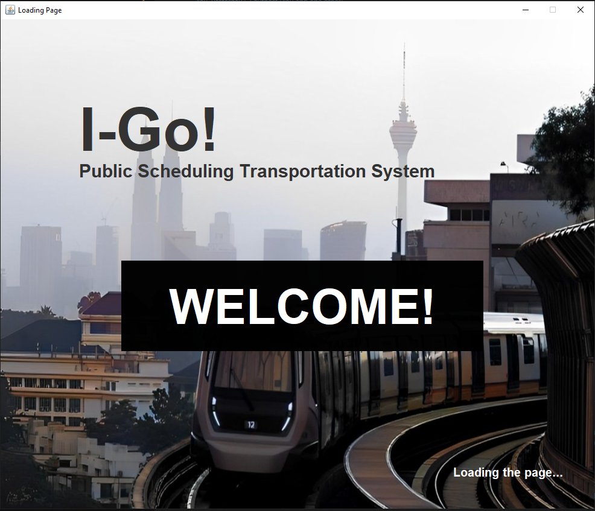

# 🚍 iGo

## 1. Introduction 📚

### Project Overview
The **iGo** project provides a user-friendly interface for managing and interacting with public transportation schedules, including both buses and trains. This project is part of a collaborative effort, where my focus was on developing a responsive and intuitive UI. The next step involves integrating the backend to make this system fully functional.

### Objective
The goal is to create a comprehensive, secure, and scalable system tailored to public transportation needs. The UI is designed to be flexible, allowing for easy backend integration and providing a seamless user experience.

## 2. Project Structure 🛠️

### Directory Overview
	src/
	├── HomePage.java          # Main entry point for the application
	├── AdminDashboard.java    # Admin interface for managing 	
	├── AdminMethods.java      # Admin interface for managing 
	├── booking.java           # Handles booking operations for usersschedules
	├── loading.java           # Displays a loading screen during startup
	├── App.java               # Main application class
	├── bg.png                 # Background image used in the UI
	└── .git/                  # Git metadata and version control

#### Key Components:
	- HomePage.java: The starting point of the UI.
	- AdminDashboard.java: Provides an interface for administrators to manage schedules.
	- booking.java: Allows users to book trips.
	- loading.java: A visually appealing loading screen for a smooth startup experience.

## 3. Backend Implementation Options 💻

   This UI is designed to be adaptable, supporting multiple backend implementation strategies. Below are two possible approaches:

   **- Simple Arrays for Data Handling**
     
     **Overview:**
     For a simpler, prototype-level implementation, using arrays or array lists can be a quick and effective solution.

      *Steps:*
   	- Data Structures: Define arrays or array lists to store schedules, bookings, and user information.
   	- Basic Operations: Implement methods to manipulate these data structures.
   	- UI Integration: Adjust the UI components to work with these in-memory data structures.

      _**Sample Code:**_
  
			import java.util.ArrayList;
			public class ScheduleManager {
			private ArrayList<Schedule> schedules = new ArrayList<>();
			public void addSchedule(Schedule schedule) {
			    schedules.add(schedule);
			}
			public void removeSchedule(int index) {
			    if (index >= 0 && index < schedules.size()) {
				schedules.remove(index);
			    }
			}
			public ArrayList<Schedule> getSchedules() {
			    return schedules;
			}
		    }
   
## 4. Getting Started 🚀
   
   **Prerequisites**
   	* Java Development Kit (JDK) 8+
   	* Integrated Development Environment (IDE): IntelliJ IDEA, Eclipse, or NetBeans recommended.
   
    **Installation**
   	- Clone the Repository
   	- Import the Project:
   	  	* Open in your preferred IDE.
   	  	* Ensure JDK is properly configured.
	- Compile and Run:
		* Use your IDE’s build tools to compile the code.
  		* Run App.java as the main class to launch the UI.
     
## 5. Images 📷

	To enhance the visual appeal of the UI, we have included some screenshots and images of the iGo application. Take a look at the following images:

	### Loading Page

*Caption: The loading page of the iGo application.*

### Home Page

*Caption: The homepage of the iGo application.*

### Admin Dashboard

*Caption: Admin dashboard for managing schedules.*

### Booking Page

*Caption: User booking interface.*

	Feel free to explore the application and see how it looks in action!

## 6. Contribution Guidelines 👥

We welcome contributions! Whether you’re fixing bugs or implementing new features, your input is valuable.

Steps to Contribute:
- Fork the repository.
- Create your feature branch (git checkout -b talha1230/iGo).
- Commit your changes (git commit -m 'Add some AmazingFeature').
- Push to the branch (git push origin talha1230/iGo).
- Open a pull request.
   
---
### Feel free to explore, experiment, and contribute to this project. Your feedback is highly appreciated!
